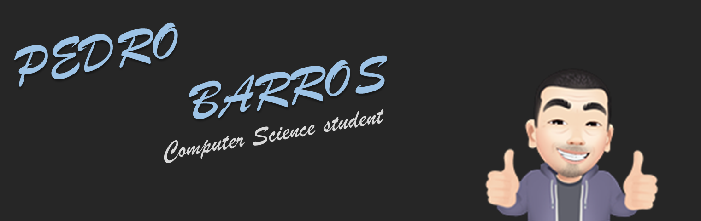

### Hi there! 👋

### Professional / Academic Summary:
Completed elementary school and high school at Colégio Curso Martins (2015). He is currently graduating with a Bachelor of Science in Computer Science from Universidade Veiga de Almeida (completion scheduled for 2021.2).

### My Goals:
Improve my skills and develop my theoretical knowledge, in order to become a qualified employee for a good position in the job market.

### Main Skills:
#### Languages:

  [Linguagem JavaScript](img/Logo_Linguagem_Java_Script.png)  

<!--
**PedroKBarros/PedroKBarros** is a ✨ _special_ ✨ repository because its `README.md` (this file) appears on your GitHub profile.

Here are some ideas to get you started:

- 🔭 I’m currently working on ...
- 🌱 I’m currently learning ...
- 👯 I’m looking to collaborate on ...
- 🤔 I’m looking for help with ...
- 💬 Ask me about ...
- 📫 How to reach me: ...
- 😄 Pronouns: ...
- ⚡ Fun fact: ...
-->
